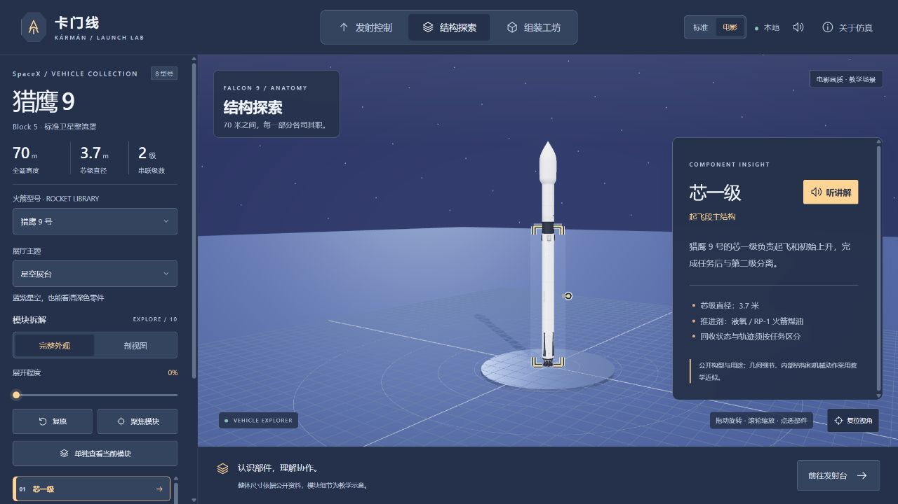
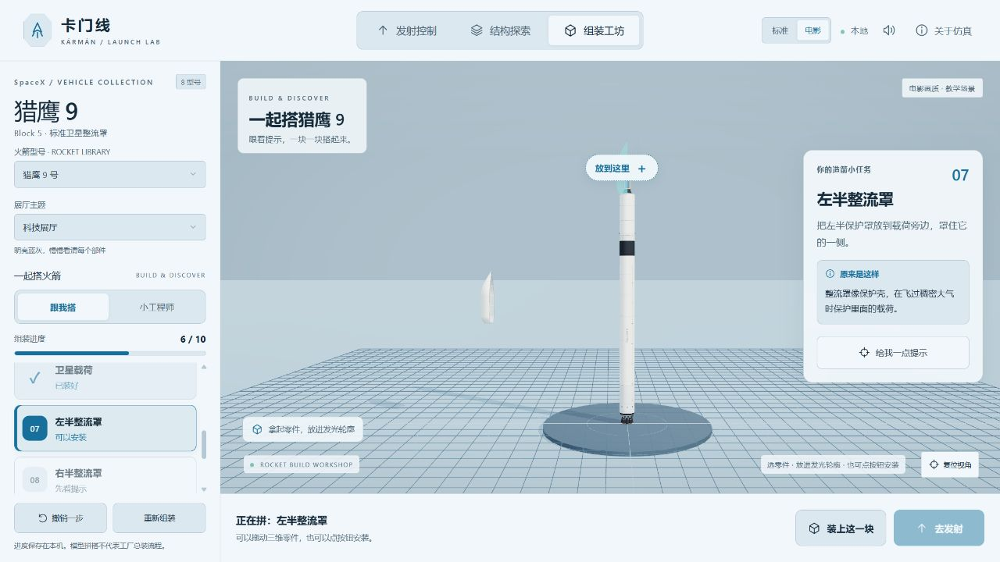

# 小小火箭工程师

**选一枚火箭，听口令点火；拆开认识它，再亲手把它组装起来。**

`rocket-launch-lab` 是面向桌面浏览器的三维火箭科普游戏，以 5～10 岁儿童的观察、聆听和动手探索为重点。本地运行，提供 **8 款火箭、7 个兼容发射工位、6 种观察视角、4 种展厅主题，以及标准／电影两档画质**。

游戏名称为「小小火箭工程师」，代码仓库和项目目录统一使用 `rocket-launch-lab`。


## 三种玩法

### 发射控制：一起数到点火

选择型号与发射场，启动带中文语音、数字和进度环的倒计时，观看点火、离台、上升、分级及任务结束。事件和可用操作随火箭构型变化。

- 自由环绕、箭体跟随、地面追踪、发动机视角、飞行全景和电影镜头。
- 暂停、恢复、重置、时间轴跳转和多档倍速；进度条、事件与仪表共用任务时钟。
- 倒数对准配置的**点火时刻**，离台时另播报「起飞」。仪式期间保持 1×，离台后 1.2 秒恢复所选倍率。
- 人声口令与发动机音效分别开关；人声默认开启，发动机音效默认关闭。
- 猎鹰 9 号和猎鹰重型包含独立教学回收情景；其他任务按各自构型展示。

### 结构探索：看清每一块零件

展开或收拢火箭，选择模块后聚焦、单独查看，或切换剖视图观察内部功能分区。

- 标题旁「听讲解」支持播放、暂停、继续和重听；介绍、参数和精度说明直接展示。
- 8 款型号的 87 个模块条目共复用 29 段本地中文讲解，不依赖电脑安装中文语音。
- 高对比角标帮助识别白色箭体上的选中部件，同时保留模型涂装。
- 剖视展示有公开依据的贮箱、穹顶、管路、环框及飞船舱段功能；未确认的布局保留中性表达。
- 科技展厅、摄影工作室、火箭小工坊、星空展台四种主题，背景与补光同步切换。



### 组装工坊：把自己的火箭搭起来

「跟我搭」提供步骤引导，「小工程师」允许按模块连接关系自由尝试。可拖动三维零件或侧栏卡片，也能点击「装上这一块」完成安装。

提供吸附提示、撤销、重新组装和完成奖励；放错位置可以继续尝试。完成后可直接发射同一型号。各型号的组装进度、主题和偏好保存在当前浏览器中。



## 火箭与发射场

| 火箭 | 本版本参考构型 | 兼容工位 |
| --- | --- | --- |
| 猎鹰 9 号 | Block 5，标准卫星整流罩 | SLC-40、LC-39A、SLC-4E |
| 猎鹰重型 | 三芯级，标准卫星整流罩 | LC-39A |
| 星舰 | V3，Super Heavy + Ship | Starbase Pad 2 |
| 长征五号 | 两芯级、四助推器 | 文昌 101 |
| 长征五号 B | 单芯级、四助推器，大型整流罩 | 文昌 101 |
| 长征七号 | 两芯级、四助推器，货运参考构型 | 文昌 201 |
| 长征八号 | 首飞双助推器参考构型 | 文昌 201 |
| 长征二号 F | 神舟载人构型，带逃逸塔 | 酒泉 921 |

切换型号会筛选兼容工位并重置任务。美国场地包括卡纳维拉尔角、肯尼迪、范登堡和 Starbase；中国场地包括文昌与酒泉，分别使用滨海或戈壁环境。构型与资料来源见 [火箭与场地资料](docs/火箭与场地资料.md)。

## 本地启动

需要 **Node.js 22.12+（或 24）**、npm，以及支持 WebGL 2 并开启硬件加速的现代桌面浏览器。已验证环境为 Windows、Node.js 24.19.0、npm 12.0.2。项目使用 Three.js 0.180.0 和 Vite 7.3.6，依赖以 [package-lock.json](package-lock.json) 为准。

**Windows 最简方式：进入 `rocket-launch-lab` 文件夹，双击 [start-local.cmd](start-local.cmd)。** 首次启动会安装锁定的依赖，保留窗口，然后访问 [http://127.0.0.1:5173](http://127.0.0.1:5173)。也可运行 [start-local.ps1](start-local.ps1)。

手动启动，在项目根目录执行：

```powershell
npm.cmd ci
npm.cmd run dev -- --port 5173 --strictPort
```

Windows PowerShell 使用 `npm.cmd` 可避免误调用受执行策略限制的 `npm.ps1`；其他系统使用 `npm`。首次安装需要网络，安装后模型、纹理、HDR 和语音均从本地加载。地图与资料外链按需联网打开。

服务只监听本机地址。按 `Ctrl+C` 停止；5173 被占用时会报告错误，不会自动换端口。请通过服务地址访问游戏，不要直接双击 `index.html`。

仓库：[VectorTyan/rocket-launch-lab](https://github.com/VectorTyan/rocket-launch-lab)（私有，需要相应访问权限）。

## 常用操作与画质

| 操作 | 效果 |
| --- | --- |
| `空格`／`R` | 启动、暂停或恢复发射／重置任务 |
| `1`—`6` | 切换六种机位 |
| 鼠标拖动／滚轮 | 在自由观察或结构视图中旋转／缩放 |
| 时间轴／倍率控件 | 跳转任务阶段／调整速度 |
| 点击结构模块／听讲解 | 选择部件／播放或暂停讲解 |
| 展厅主题 | 更换结构探索与组装的背景、补光 |
| 提示／撤销一步 | 辅助拼搭／退回上一步 |

「电影」档使用本地 HDR 光照与反射、抗锯齿、泛光、阴影、表面纹理和喷口尾焰，属于浏览器实时高画质效果；显卡负担较高时可切回「标准」。自动运镜的「电影镜头」与画质档位分别选择。

## 开发、测试与提交

| 命令 | 用途 |
| --- | --- |
| `npm.cmd test` | 全套数据、模型、状态和交互回归测试 |
| `npm.cmd run test:integration` | 应用交互、存档恢复与生命周期集成测试 |
| `npm.cmd run format:check`／`npm.cmd run format` | 检查／统一已模块化代码格式 |
| `npm.cmd run build` | 构建到 `dist/` |
| `npm.cmd run check` | 格式检查 → 全套测试 → 生产构建 |
| `npm.cmd run preview -- --port 5173 --strictPort` | 本地预览已构建的 `dist/` |

提交前运行 `npm.cmd run check`；修改三维效果、交互或音频时，还需要在浏览器验证对应流程。自动测试的 DOM、时间和音频替身不能替代真实 GPU 与音频设备检查。结果及覆盖边界见 [验证记录](docs/验证记录.md)。

**每次上传代码都先创建明确的 Git commit，再推送对应分支。** 提交说明应概括改动与目的；不提交 `node_modules/`、`dist/`、缓存或临时验证产物。本项目独立维护为一个游戏仓库。

## 代码结构与扩展

应用协调、玩法、界面模板、三维渲染与领域规则分开维护。应用入口组装各模块，玩法通过三维接口操作场景，渲染模块负责自身资源的创建和释放。

| 路径 | 职责 |
| --- | --- |
| [src/main.js](src/main.js)、[src/app/](src/app/) | 应用启动、模式切换、偏好、帧循环和生命周期 |
| [src/features/](src/features/) | 发射与倒计时、结构讲解、组装及音效 |
| [src/ui/](src/ui/)、[src/styles/](src/styles/) | 页面模板、图标、配置和分模块样式 |
| [src/rendering/scene/](src/rendering/scene/) | 相机、拾取交互、环境、展厅与型号资源 |
| [src/rendering/cutaway/](src/rendering/cutaway/) | 截面计算、内部结构、材质与几何缓存 |
| [src/fleet-data.js](src/fleet-data.js)、[src/fleet-model.js](src/fleet-model.js) | 型号资料、兼容场地和模型构型 |
| [src/fleet-simulation.js](src/fleet-simulation.js)、[src/mission-timeline.js](src/mission-timeline.js) | 任务事件、教学轨迹和统一计时 |
| [src/assembly-state.js](src/assembly-state.js)、[src/interior-data.js](src/interior-data.js) | 拼搭规则与内部结构依据 |
| [public/assets/](public/assets/) | 本地环境、地球影像与语音资源 |
| [scripts/](scripts/)、[tests/](tests/) | 资源处理与回归检查 |
| [docs/](docs/) | 架构、设计、资料来源、验证记录与截图 |

新增火箭需要同时补充资料、几何、兼容场地、任务、组装关系及讲解。入口、依赖方向和生命周期约定见 [架构与扩展指南](docs/架构与扩展指南.md)；主题和儿童交互设计见 [主题与组装设计](docs/主题与组装设计.md)。

## 科普还原范围

- 公开整体尺寸与主要构型提供比例基准；模块长度、管路、连接件和表面细节仍有教学近似，不能作为工程级 1:1 模型。剖视功能色不代表推进剂的实际外观，见 [剖视结构依据](docs/剖视结构依据.md)。
- 猎鹰 9 号上升事件参考公开 LEO 样例；其他型号时间表和全部轨迹、姿态、仪表采用教学编排或插值。回收为独立示意，星舰「完成」表示亚轨道演示结束。组装玩法表达模块连接关系，不等同工厂总装流程。
- 发射场采用程序地形与设施示意。Google Maps 外链用于位置参考，未抓取或打包 Google 底图，也未进行地形、道路和塔架的测绘配准。

## 素材与来源

| 资源 | 说明 |
| --- | --- |
| [环境 HDR](public/assets/environment/ATTRIBUTION.md) | Greg Zaal / Poly Haven，CC0，约 6.4 MB；用于光照和反射 |
| [地球影像](public/assets/earth/ATTRIBUTION.md) | NASA Blue Marble 2002 历史合成影像，约 267 kB；用于高空远景 |
| [模块讲解](public/assets/narration/README.md) | 本地合成中文音频，约 26.7 MB；按需加载单段 |
| [发射口令](public/assets/countdown/README.md) | 本地合成数字与点火／起飞口令，12 段、约 0.2 MB |

素材授权与项目代码的授权相互独立；各资源来源、生成方式与校验说明见对应链接。
