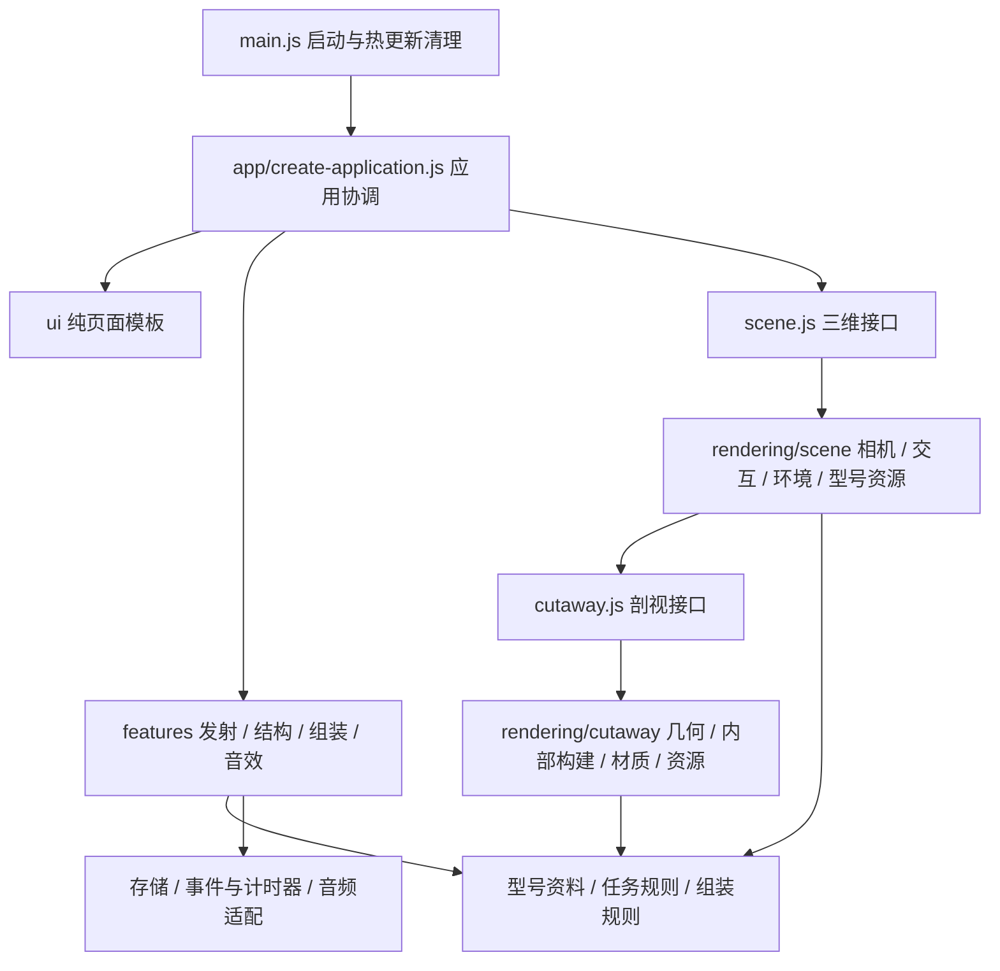

# 架构与扩展指南

本次重构保留八种型号、任务时间、素材、界面控件和 `karman.*` 存档格式。入口负责组装应用，玩法各自管理状态，三维模块各自管理几何与资源。新增的测试会限制跨层依赖，并验证切换、恢复与销毁行为。

## 依赖方向



`ui/` 只返回 HTML 字符串，不查询页面、不启动三维渲染。`features/` 通过传入的 `context.scene` 使用三维接口；不会直接导入 Three.js。`rendering/` 不导入页面和玩法组件。任务和组装规则可以在 Node.js 中独立运行。

`app/create-application.js` 是连接这些部分的入口。它决定型号、兼容发射场、体验模式、主题和画质；向功能模块提供只读的当前上下文。功能模块通过回调请求跨模式操作，例如“组装完成后去发射”。

## 文件与职责

| 位置 | 职责与状态所有者 |
| --- | --- |
| `src/main.js` | 启动应用，注册 Vite 热更新清理 |
| `src/app/create-application.js` | 挂载、模式切换、型号与场地切换，注入平台依赖 |
| `src/app/shell-view.js` | 共享标题、主题、画质、关于说明和提示信息 |
| `src/app/preferences.js` | `karman.*` 读写与存储不可用时的内存回退 |
| `src/app/lifecycle.js`、`frame-loop.js` | 页面监听、计时器、可停止的动画帧循环 |
| `src/features/launch/mission-controller.js` | 唯一任务时钟、播放状态、追踪对象、暂停策略、末端载荷展示 |
| `src/features/launch/view.js` | 播放按钮、时间刻度、事件导航和遥测显示 |
| `src/features/assembly/` | 各型号存档恢复、拼搭交互、反馈和完成奖励 |
| `src/features/structure/` | 选中模块、展开、隔离、剖面位置和本地讲解 |
| `src/features/audio/engine-sound.js` | 按用户操作创建并释放发动机合成音效 |
| `src/ui/` | 页面壳、各区模板、图标、展示配置和格式化函数 |
| `src/styles/` | 16 个按职责组织、按既有层叠顺序导入的样式文件 |
| `src/rendering/scene/` | 相机、浮动原点、指针交互、环境、展厅、发射台和型号资源 |
| `src/rendering/cutaway/` | 截面计算、材质克隆、贮箱/飞船内部构建、几何缓存和资源释放 |

既有领域模块仍保留稳定路径，例如 `fleet-data.js`、`fleet-simulation.js`、`assembly-state.js`、`mission-timeline.js`、`interior-data.js`。`createScene()` 和 `createCutaway()` 的公开方法保持兼容，原有几何、仿真和剖视测试继续运行。

## 状态与生命周期约定

1. 任务时间由 `MissionClock` 和 `mission-controller` 管理。每帧得到同一份 `frame`，三维展示用 `frame.renderState`，界面用 `frame.state` 和 `frame.timeline`。切倍率先结算点击前的旧倍率；渲染时间步的上限不会缩短任务经过的真实时间。
2. `AssemblyGame` 管理拼搭规则；`progress-store` 恢复历史时重新检查模块、先决条件和型号。存档的 `completed`、`progress` 数字不能绕过规则。存储写入失败时，本次页面仍可继续游戏。
3. 结构视图使用数值状态管理展开、隔离和剖面位置，页面按钮显示该状态。模块讲解有独立播放器，切换部件和退出结构模式会停止旧讲解。
4. `createApplication()` 返回 `dispose()`。挂载到同一根节点前先释放旧实例；释放后不会继续调度 RAF。所有 DOM 查询局限在传入根节点，文档级快捷键与可见性监听也会解绑。
5. 渲染层由创建者释放资源。型号切换先恢复/释放临时组装和剖视控制器，再释放底层箭体；借用的材质和贴图不会被重复销毁。指针捕获、OrbitControls、ResizeObserver、PMREM 和阴影贴图有明确所有者。
6. 应用事件作用域支持计时器取消和异步结果清理；渲染释放作用域管理同步 GPU 构造过程。两者均按相反注册顺序释放，清理某一资源失败时仍继续清理其余资源。

## 新增能力的入口

### 添加火箭型号

- 在 `fleet-data.js` 增加型号资料、实际模块及兼容工位；在 `fleet-model.js` 添加或选择几何构型。
- 在 `fleet-simulation.js` 配置独立任务和事件，不在页面里硬编码任务秒数。
- 在 `interior-data.js` 写清结构依据与未知项，按需要扩展 `rendering/cutaway/interiors.js`；通用剖面算法不依赖型号名称。
- 检查组装模块、依赖关系和讲解。修改 `module-narration.js` 文案后，运行原有语音生成脚本，更新本地音频映射。
- 执行完整检查，补充该型号的资料、几何、任务、组装与界面回归用例。

### 添加玩法或界面控件

新玩法在 `features/` 下建立自己的控制器，明确输入、回调和 `dispose()`。应用协调层负责进入/退出及跨玩法切换；模板放到 `ui/`，对应样式放到 `styles/`。新增普通按钮通过所属功能模块的事件作用域绑定，动态列表优先在容器上绑定一次事件，避免切型号后叠加监听。

### 修改三维效果

相机机位放在 `camera-rig.js`，拖动和拾取放在 `interactions.js`，展厅外观放在 `studio-display.js`，场地环境和灯光放在 `environment.js`。新增模型临时视图应由 `vehicle-stage.js` 管理并释放。剖面几何用 `section-geometry.js` 的纯计算接口；退化三角形过滤必须保留，以避免 HDR 泛光出现无效法线黑块。

### 修改样式

`src/style.css` 是唯一样式入口。文件顺序保留原有层叠关系；添加或移动规则前检查它依赖的覆盖顺序。使用同一格式化配置归一化后，重构前后完整 CSS AST 一致，规则、声明、优先级和媒体规则顺序保持不变。

## 验证与维护

```powershell
npm.cmd ci
npm.cmd run test:integration
npm.cmd run check
```

- `test:integration`：应用 DOM/用户操作集成测试和平台服务测试。使用固定版本 jsdom、真实领域模型，以及可控制的时间、存储、音频和渲染替身。
- `check`：新架构模块格式检查 → 全套 Node.js 测试 → Vite 生产构建。
- `format`：格式化已重构的入口、应用、玩法、模板、渲染子模块和样式。
- `tests/architecture.test.js`：检查模块依赖方向、静态相对导入目标和循环依赖。
- 浏览器验收仍需覆盖真实 WebGL、拖动、镜头、主题和音频；jsdom 不提供真实 GPU 或音频设备仿真。

实际结果及未覆盖的平台见 [验证记录](验证记录.md)。
