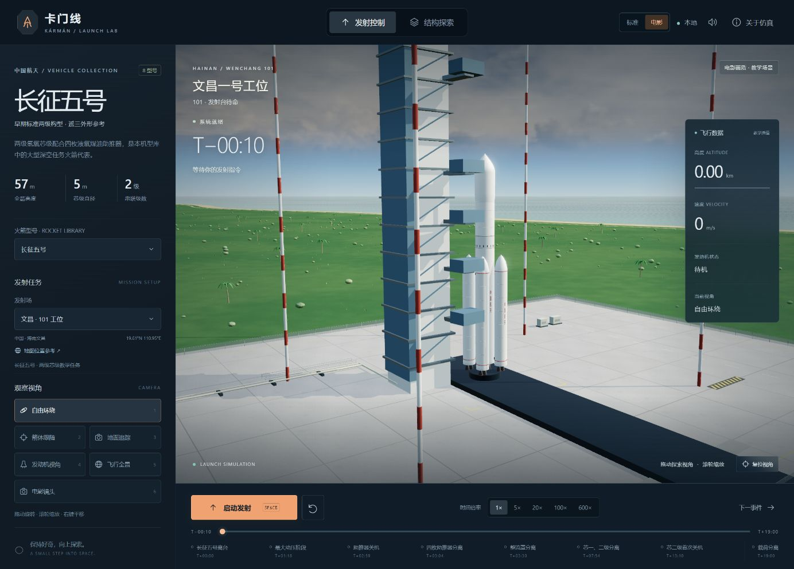
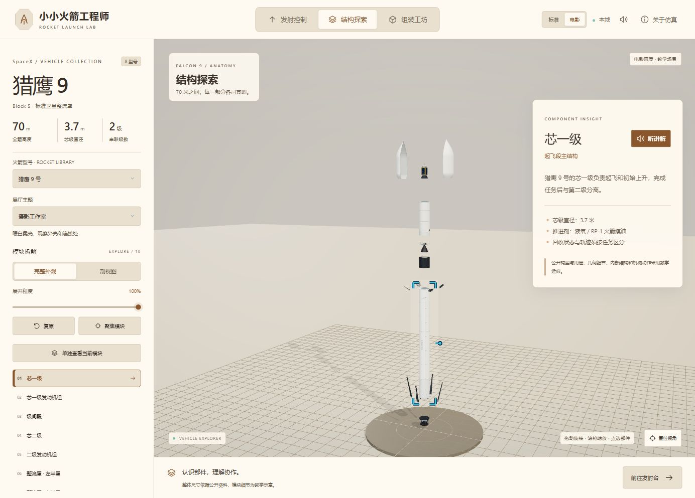

# 本地版本验证记录

验证日期：2026-10-01（Asia/Shanghai）。

## 环境与结果

| 项目 | 结果 |
| --- | --- |
| 系统 | Windows，本地工作目录 Game4Youzi |
| 运行时 | Node.js 24.19.0、npm 12.0.2 |
| 三维与构建依赖 | Three.js 0.180.0、Vite 7.3.6，见 package-lock.json |
| 自动测试 | 人声倒计时与面板版本：325 项通过，0 失败、0 跳过 |
| 生产构建 | `npm.cmd run build`：成功，输出 dist/ |
| 依赖检查 | 安装修复版本后 npm audit 报告 0 项漏洞；这是该次依赖检查结果 |
| 本地服务 | 127.0.0.1:5173，绑定回环地址 |
| 浏览器 | Codex 内置 Chromium 浏览器，实际三维渲染与操作检查 |
| 启动脚本 | PowerShell 脚本通过语法检查；CMD 提供双击入口。缺依赖的首次安装路径未另做清空环境重装 |

## 自动检查范围

以下保留 192 项原有回归，并新增 90 项模块边界、资源生命周期与应用集成检查。

- 16 项型号资料检查、15 项多型号几何与状态检查、13 项喷管与尾焰对齐检查，涵盖全部八款。
- 10 项原猎鹰 9 号任务检查、16 项多型号任务检查、8 项世界坐标检查，涵盖倒放、重置、点火差异、热分离、单芯级和不回收分支。
- 11 项猎鹰 9 号模型检查（含二级安装连接修复），以及 9 项 NASA 地球纹理、七场地经纬朝向、加载失败与资源释放检查。
- 31 项剖视检查：八型号外形/模块不变，选择性裁切、材质恢复、剖面跟随单模块、已确认储箱顺序、未知布局灰舱区、共底/管路适用范围、神舟/货运功能区、动态截面/空腔、有效法线和资源释放。
- 21 项组装规则检查：八型号完整步骤、实际模块一致性、前置连接约束、引导/自由玩法、重复放置、撤销、完成与重置。
- 16 项组装视图检查：实际几何中心、八型号姿态恢复、拖动/吸附/回弹、提示目标与实例几何、隐藏剖视对象排除、资源所有权和异常坐标。
- 13 项时间轴检查：真实时间刻度、当前/下一事件、回收排序/去重、换倍率时结算旧速度、跨事件、可见卡顿/后台暂停，以及模型的绝对事件计时。
- 8 项选择反馈检查：原始材质不改、保留几何定位、多裁切平面、实例网格、隔离/展开、亮暗主题和独立资源释放。
- 5 项讲解检查：87 模块文案与 29 段非空本地音频一致、机型差异、暂停/重听/变速、旧播放回调隔离和错误恢复。

尺寸检查只证明模型整体包围尺寸符合设定值，不能证明全部模块细节与真实火箭一致。

## 人声倒计时与模块面板（2026-10-01）

- 在模块化版本的 282 项检查基础上新增 43 项：21 项倒计时/倍率边界，17 项音频生命周期，2 项本地音频内容与时长校验，3 项应用集成。旧普通倍速测试通过手动时间轴回放验证，新增测试单独验证仪式窗口的 1× 策略。
- 倒数按原有点火时刻计算：猎鹰 9 号及长二 F 从 7 倒数，猎鹰重型/长七/长八从 6，长五/五号 B 从 5，星舰从 4。各型任务仍从 T−10 秒开始；原始点火事件和 T+0 离台事件不变。
- 仪式窗口一直到 T+1.2 秒采用 1×；跨窗口的大帧先结算 1× 时间，再用所选倍率处理剩余时间。暂停、后台、模式切换、重置、跳转、重播、非法倍率及浮点边界均有回归。
- 音频覆盖首次同步播放、当前数字去重、不排队、暂停续播、静音与恢复、旧回调失效、资源失败和幂等卸载。12 段短音频的 PCM 数据、时长和 SHA-256 已验证。
- 浏览器实际启动并观察倒数到离台，核对人声开关、仪式期间的 1× 与待恢复倍率提示，以及后续发动机火焰和上升状态；未报告语音播放失败。没有进行主观配音质量或所有音频设备的评测。
- 模块面板按用户示意图调整为标题右侧紧凑“听讲解”按钮，下面直接展示原有模块介绍、参数和精度说明。旧讲解卡片、讲解稿与折叠标题已移除；播放、暂停与切换模块停止语音已检查。
- 另外复核了窄窗口的响应式样式，参数列表和精度说明都保持默认可见，不再沿用旧版的隐藏规则。该样式修正后再次通过格式检查和生产构建，并在浏览器读取到两者 `display: block`。

截图：[人声倒计时](preview-launch-countdown.jpg)、[离台后飞行](preview-launch-flight.jpg)、[模块面板](preview-module-listen.jpg)。

## 模块化重构（2026-10-01）

本轮以独立分支 `refactor/modular-architecture` 进行。入口、应用协调、发射/结构/组装/音效、纯模板、分层样式和渲染资源分别归位。架构、状态所有权和扩展入口见 [架构与扩展指南](架构与扩展指南.md)。

| 新增检查 | 数量 | 覆盖 |
| --- | --- | --- |
| UI 模板 | 14 | 八型兼容场地、控件与标签、转义、格式化及配置 |
| 剖切算法/资源 | 11 | 截面几何边界、退化面、缓存、替换几何与幂等释放 |
| 三维场景拆分 | 25 | 相机、位置计算、真实射线拾取、拖动捕获/取消、观察器、共享资源和部分构造失败 |
| 平台与应用服务 | 22 | 旧存档校验、拒绝存储、事件/计时器/RAF清理、时间控制及音频异步竞态 |
| 应用 DOM 集成 | 12 | 模式/型号切换、倍率同步、组装闭环、讲解、后台暂停、WebGL失败、重复挂载及快捷键 |
| 架构边界 | 6 | 相对依赖存在、无静态循环、UI/领域/玩法/渲染依赖方向 |

- 最终 `npm.cmd run check` 通过：格式检查、282 项测试及生产构建均成功。随后将架构检查使用的 Rollup 解析器显式声明为直接开发依赖，并再次运行 6 项架构检查；原有依赖版本没有变化。
- 使用同一格式化配置归一化后，比对重构前样式与按入口顺序拼接的分片，完整 CSS AST 一致。原页面 111 个 ID 均保留。剖视重构另对照八机型、三个切面位置共 24 组几何和元数据摘要，结果一致。
- 浏览器实际检查：启动与倍速、分级事件跳转、六种镜头、剖视聚焦、讲解播放/暂停/慢速、模式互切、八型号切换和旧组装进度恢复。实际将已完成型号撤销一步，再通过三维拖放装回，进度恢复为 10/10 并出现奖励。
- 观察了桌面宽窗口和应用窄侧栏的现有响应式布局；本轮不改变原设计。浏览器检查未报告控制台错误或警告。
- jsdom 和渲染替身用于隔离测试，不代表真实 GPU、所有 Chrome/Edge 版本、音频设备或长期内存压力均已验收。原有三维主包超过 500 kB 的构建提示仍存在。

预览见 [重构后运行截图](preview-refactor.jpg)。

## 时间、儿童讲解与剖面填充（2026-10-01）

- 修复三处时间表现问题：旧界面最多 75 ms 的刷新滞后在 600× 下约等于 45 秒；切倍率时上次绘制到点击的时间应按旧倍率结算；原等距事件列表不能当成线性时间刻度。现时钟、进度、刻度、当前/下一事件均逐帧使用同一份任务时间。
- 浏览器实际连续切换 20×→100×→5×→600×→1×，核对时钟、进度百分比、最近/下一事件和选中事件卡一致。暂停后跳到猎鹰 9 号 T+02:28，进度与分级刻度均为 4.6470588%；暂停中改为 600× 仍保持 148 秒。
- 儿童讲解采用本机离线生成的中文音频。浏览器实际验证加载到播放、暂停、慢一点、重听，以及切换火箭后回到未播放状态；不要求安装系统中文语音，不请求麦克风。未进行多品牌音响或主观配音质量评测。
- 白色长征五号 B 在星空与明亮主题下检查新的角标、深浅双底线和轻微背景弱化；箭体本色保留。猎鹰 9 号剖视与单独查看也能跟随所选部件。
- 猎鹰 9 号二级实际查看中心与 +80% 偏移剖面：功能介质面随切面位置收窄，壳层边缘保留。标准和电影档均检查过近景，级间与整流罩空腔不填成实心。
- 首次电影档聚焦出现矩形黑块，定位为穹顶端点和相合边缘生成了退化三角形；剔除这些面后，截面法线均有限且为单位长度。浏览器复核黑块消失，新增全八型、多偏移回归检查。
- 最新全套 192 项测试通过；生产构建成功，仍有三维主包超过 500 kB 的体积提示。未进行长期 GPU 内存压力测试。

截图：[时间轴与事件对齐](preview-timeline-sync.jpg)、[剖面填充、讲解与选中反馈](preview-interior-narration.jpg)。

## 明亮主题与组装工坊（2026-10-01）

- 结构探索与组装新增科技展厅、摄影工作室、火箭小工坊、星空展台；同步调节界面、背景、地面、补光和工作室反射。返回发射时恢复场地环境。
- 实际浏览器检查四种主题；暖白和星空下检查猎鹰 9 号剖视、标准/电影画质切换，并检查剖视进入组装时恢复完整外壳。
- 实际拖动星舰助推级到轮廓完成安装；发动机拖到错误位置时保持进度并温和提示；从侧栏卡片拖入也能安装。按钮辅助、撤销、提示、未满足连接条件的拒绝均已检查。
- 完成星舰全部九步，验证完成奖励及“我的火箭，出发！”从相同型号的兼容场地开始倒计时，完整箭体、天空和尾焰恢复。
- 实际切换八款火箭，检查各自零件数；其余六款均检查第一步安装与重置。长征五号 B 不含不存在的芯二级。
- 猎鹰 9 号使用“小工程师”先安装芯一级和级间段，再切换型号并刷新页面；回到工坊后仍为 2/10，自由玩法和下一块选择恢复。切换主题不丢进度。
- 继续拼到第七步，检查部件盒自动平滑滚动到下一块；主体页面位置保持不变。最终浏览器日志未报告错误或警告。
- 桌面预览检查底栏、提示卡与独立滚动部件盒。拖拽时冻结相机阻尼；多指和非左键事件有防误触处理，但未做触摸屏实机测试。
- 全套 160 项检查通过，构建成功。Vite 仍提示三维主包超过 500 kB；没有运行持续帧率或 GPU 压力测试。

预览：[暖白剖视展厅](preview-studio-cutaway.jpg)、[组装工坊](preview-assembly.jpg)、[完成奖励](preview-assembly-complete.jpg)。

## 二级连接与剖视更新（2026-10-01）

- 猎鹰 9 号原模型在级间外壳顶部与二级尾部存在约 0.95 米外轮廓空档，已补充开口尾裙、安装环、燃烧室与承力连接。总高、芯径及真空喷管出口坐标保持不变，猎鹰重型共用芯级同步修复。
- 结构探索新增完整外观/剖视图切换、剖面位置、正面剖视和单模块剖视；启用剖视会收拢展开状态，返回发射时自动恢复完整材质与外壳。
- 内部按 [公开资料目录](剖视结构依据.md)区分：确认顺序的推进剂箱用功能色表示，未核实的箱序只显示灰色舱区范围；不为未知模块拼出虚构的上下或并列贮箱。
- 补充 Falcon 共底穹顶、双壁输氧管、三处连接锁扣及四个分离推杆的结构示意。神舟/货运示例只表达有公开说明的舱段功能和设备区，不代表任务批次实装。
- 浏览器检查二级发动机与尾裙的连续外轮廓、发动机剖视连接、二级储箱、单独剖看侧助推器与神舟功能区。尺寸、箱体分界、管线、座椅和设备位置仍为教学近似。
- 剖视通过材质裁切实现，不改写原始外部几何；新增内部物体在关闭时隐藏，在模型切换时释放。截图见 [二级连接剖视](preview-falcon9-cutaway.jpg)。

## 多型号与电影画质检查（2026-10-01）

- 在浏览器实际切换全部八款型号，核对各型号标题、尺寸、模块、可选工位及独立时间轴；猎鹰重型仅出现 LC-39A，星舰仅出现 Starbase，长征型号仅出现其对应中国工位。
- 观察猎鹰重型三芯级、星舰完整金属外形与裙段、长征五号四助推器、五号 B 单芯级展开，以及长征七号/八号的构型差异。
- 酒泉场景确认为戈壁、没有海面；文昌场景为热带海岸。Google Maps 外链保留各地带正负号的区域经纬度，不作底图配准。
- 检查二号 F 的电影机位上升、八台起飞主机尾焰、终点飞船分离展示，以及分离展示后才出现的任务完成提示。
- 检查星舰结束界面明确为亚轨道演示，没有载荷部署、真实入轨、再入或回收完成的误报。
- 标准与电影两档均实际切换。电影档使用本地 HDR、后期泛光、微表面材质、匹配喷口的尾焰和高分辨率阴影；独立电影镜头自动运镜。
- 修正不回收型号分离时一级直接消失、单独查看时误点隐藏外壳、载荷直接跳到释放终点等问题。
- 最终浏览器检查未报告控制台错误或警告。截图见 [星舰电影画质](preview-starship-cinema.jpg) 与 [文昌长征五号](preview-longmarch-cinema.jpg)。

## 首版已执行的浏览器流程

1. 打开首页，确认三维发射台、火箭、仪表和控制台实际呈现。
2. 从倒计时启动并使用倍速，暂停观察一级上升与喷焰。
3. 跳转到两级分离、整流罩分离后及二级关机，观察不同箭体状态；切换箭体跟随与发动机机位。
4. 查看一级着陆示意与发动机近地机位，确认四条着陆腿和着陆区可见。
5. 在三处发射场之间切换，核对场地名称、坐标、环境差异及任务复位。
6. 使用 600× 从倒计时运行到 T+56:30，确认任务完成面板出现；关闭面板后能看到与二级分开的示例卫星。
7. 验证 R 重置、数字键切镜头、空格启动与暂停。
8. 进入结构模式，展开、选择、聚焦并单独查看发动机组；确认模块介绍与当前选择一致。
9. 返回发射模式，恢复完整火箭与待命状态。该轮浏览器日志未报告错误或警告。

## 预览

## 环境细化更新（2026-10-01）

- 新增大气天空、分层程序云、太阳光晕与天空环境反射；新增海面细浪、浅水沙岸、平滑丘陵和实例化植被。
- 新增混凝土接缝、道路颗粒、围网、黄线、设备箱、管线和储罐栏杆。环境资源均本地生成，没有新增在线模型或图片请求。
- 浏览器实际检查了佛州与西岸预设、三场地切换、200 km 高空视角、地面追踪高空目标、结构模式恢复和一级着陆后的环境恢复。
- 已修正天空跟随箭体高度变黑的问题；以相机实际高度控制大气、雾与星空。地面追踪时阴影范围也跟随地面设施。
- 初次环境反射生成出现采样范围警告，已将模糊参数从 0.06 降至 0.025。修改后未发现新增着色器错误。
- 26 项原有逻辑和模型回归检查通过；构建成功。资源释放与场景接口另经代码检查，未做持续帧率或 GPU 内存压力测试。

## 验证边界

- 没有进行真实飞行动力学、制导、气动、发动机流场或工程结构认证。遥测为教学插值，回收轨迹为独立示意。
- 发射设施与周边地形采用本地程序几何，不是实际场地测绘数据；高空地球使用 NASA Blue Marble 历史合成影像，不是实时地图或天气。
- 本轮没有覆盖独立 Chrome/Edge 全版本、低性能显卡、移动设备或帧率基准。合成音效没有做声学保真验收。
- 三维 JavaScript 主包超过默认 500 kB 阈值，Vite 会显示体积提示；这不阻止构建。另含约 6.4 MB 的 CC0 HDR 与 267 kB 的 NASA 图像，均从本地加载。运行时不加载在线外部模型、地图瓦片或字体。

关于公开资料与模型精度的说明见 [模型与资料说明](模型与资料说明.md)。
